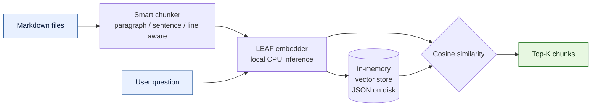
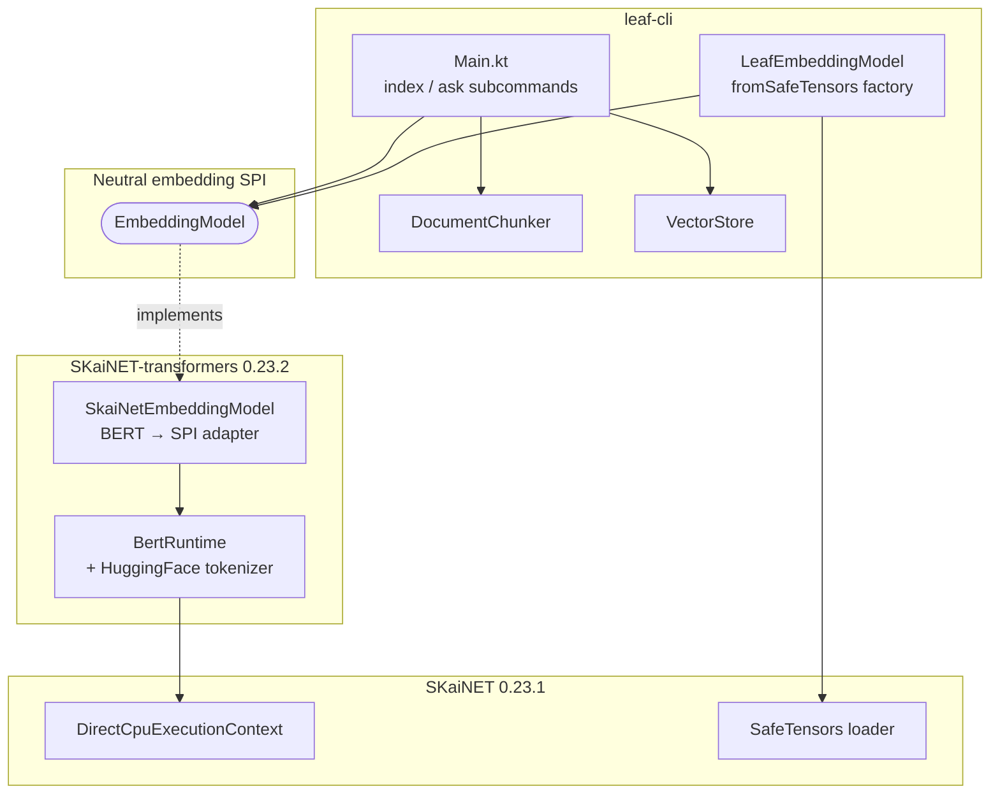

# leaf-cli

A semantic search CLI built on pure JVM. Index your markdown documentation and query it with natural language — no database, no external vector engine, no Python.

Built as a companion project for the JavaLand Unconference session: **"Build Your Own Semantic Search Engine in Pure JVM (No DB, No Magic)"**.

## How it works



1. **Index** — reads `.md` files, splits them into overlapping chunks, generates embeddings using the [MongoDB/mdbr-leaf-mt](https://huggingface.co/MongoDB/mdbr-leaf-mt) model, and saves the index to a JSON file.
2. **Ask** — loads the index, embeds your question, computes cosine similarity against all stored chunks, and returns the most relevant results.

## Prerequisites

- Java 21+
- A local copy of the [MongoDB/mdbr-leaf-mt](https://huggingface.co/MongoDB/mdbr-leaf-mt) model (SafeTensors format)

The model is auto-detected from these locations (in order):

1. `--model-dir` CLI argument
2. `LEAF_MODEL_DIR` environment variable
3. HuggingFace cache: `~/.cache/huggingface/hub/models--MongoDB--mdbr-leaf-ir/snapshots/`
4. Deliverance cache: `~/.deliverance/MongoDB_mdbr-leaf-ir/`

## Build

```bash
./gradlew shadowJar
```

Produces `build/libs/leaf-cli-all.jar`.

## Usage

### Index a folder of markdown files

```bash
java --enable-preview --add-modules jdk.incubator.vector \
  -jar build/libs/leaf-cli-all.jar index ./docs
```

Options:

| Flag | Default | Description |
|------|---------|-------------|
| `-m`, `--model-dir` | auto-detected | Path to LEAF model directory |
| `-o`, `--output` | `leaf-index.json` | Output index file path |
| `--chunk-size` | `600` | Target chunk size in characters |

### Ask a question

```bash
java --enable-preview --add-modules jdk.incubator.vector \
  -jar build/libs/leaf-cli-all.jar ask "How do I reset a password?"
```

Options:

| Flag | Default | Description |
|------|---------|-------------|
| `-i`, `--index` | `leaf-index.json` | Path to index file |
| `-k`, `--top-k` | `3` | Number of results to return |

### Example output

```
Loading index... done (142 documents)
Loading model... done (1.2s)
Searching... done (45ms)

Question: "How do I reset a password?"
Top 3 results:
────────────────────────────────────────────────────────────

  #1  Score: 0.8234  Source: docs/auth/password-reset.md
  ──────────────────────────────────────────────────────────
  To reset a password, navigate to the settings page and click...

  #2  Score: 0.7891  Source: docs/onboarding/accounts.md
  ──────────────────────────────────────────────────────────
  New users receive a temporary password that must be changed...

  #3  Score: 0.6543  Source: docs/security/credentials.md
  ──────────────────────────────────────────────────────────
  Credential rotation policies require password changes every...
```

## Architecture



```
src/main/kotlin/sk/ainet/apps/leaf/cli/
├── Main.kt              # CLI entry point (index & ask subcommands)
├── ModelResolver.kt     # Model discovery and config detection
├── LeafEmbeddingModel.kt # Spring-AI-shaped factory returning the neutral EmbeddingModel SPI
├── DocumentChunker.kt   # Smart markdown chunking with overlap
├── VectorDocument.kt    # Serializable document + embedding container
└── VectorStore.kt       # In-memory vector storage and cosine similarity search
```

## Tech stack

| Component | Technology |
|-----------|------------|
| Language | Kotlin 2.3.0 |
| JVM | Java 21 (with Vector API incubator) |
| Build | Gradle 8.13 (Kotlin DSL) |
| Embedding API | SKaiNET-transformers neutral `EmbeddingModel` SPI (0.23.2) |
| Model inference | SKaiNET BERT runtime on CPU (engine 0.23.1 via transformers BOM) |
| Model format | SafeTensors |
| Embedding model | MongoDB/mdbr-leaf-mt (multilingual, 768-dim output) |
| CLI parsing | kotlinx-cli |
| Serialization | kotlinx-serialization (JSON) |
| Packaging | ShadowJar (fat JAR) |

## Key design decisions

- **Neutral embedding API** — `LeafEmbeddingModel.fromSafeTensors(modelDir)` returns an `EmbeddingModel`, a small provider-neutral SPI shaped like the `embed(text)` / `embed(listOf(...))` / `call(EmbeddingRequest)` contract found across mainstream Java AI frameworks (Spring AI in particular). The factory mirrors `Gemma4ChatModel.fromSafeTensors(...)` upstream — singleton object, single one-call entry point that hides the runtime / weight-loader / tokenizer assembly behind the SPI. The CLI never touches BERT-specific types directly, so swapping the underlying model later is a one-file change.
- **No database** — embeddings live in memory and persist as plain JSON. Vector databases are an optimization layer; this project teaches the fundamentals.
- **No external services** — model inference runs locally on CPU via SKaiNET's BERT runtime.
- **Smart chunking** — the chunker respects paragraph, sentence, and line boundaries rather than cutting mid-word. Chunks overlap by 100 characters for context continuity.
- **Brute-force search** — cosine similarity is computed against every stored embedding. Simple, correct, and sufficient for documentation-scale corpora.
- **Multilingual** — the LEAF model supports 50+ languages out of the box. Index English docs, query in German — it works.

## Version pinning

The app pins **`sk.ainet.transformers:*:0.23.2`** via `platform("sk.ainet.transformers:skainet-transformers-bom:0.23.2")` from public Maven Central. The transformers BOM transitively imports the engine BOM (`sk.ainet:skainet-bom:0.23.1` — the engine line tops out at 0.23.1; transformers 0.23.2 is a transformers-only patch on the same engine), so every `sk.ainet.core:*` artifact aligns to `0.23.1` automatically. The version-catalog entries for the engine artifacts list the module coordinates without `version.ref`, leaving the BOM as the single source of truth. The version knob lives in one place: `gradle/libs.versions.toml` (`skainetTransformers = "0.23.2"`).

`LeafEmbeddingModel.kt` references engine types (`DirectCpuExecutionContext`, `SafeTensorsParametersLoader`, `FP32`, `JvmRandomAccessSource`) directly, so the four `sk.ainet.core:*` `implementation` lines in `build.gradle.kts` are required for the compile classpath — upstream declares them as Gradle `implementation` (runtime-only for consumers). Once the one-call `BertEmbeddingModel.load(...)` loader from the PRD lands, the engine types stop leaking into consumer code and those four lines go away.

The next simplification — replacing `LeafEmbeddingModel.kt`'s ~100-line load path (multi-loader merge for `2_Dense/model.safetensors`, config auto-detect, vocab parsing) with a one-call `BertEmbeddingModel.fromSafeTensors(modelDir)` upstream — is tracked by [`PRD-skainet-transformers-bert-embeddings.md`](../PRD-skainet-transformers-bert-embeddings.md) at the workspace root and will land in a future transformers release.

## License

MIT
