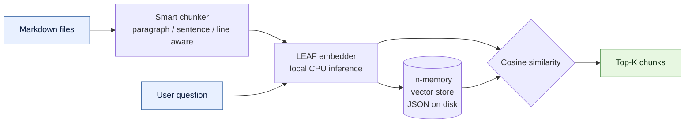
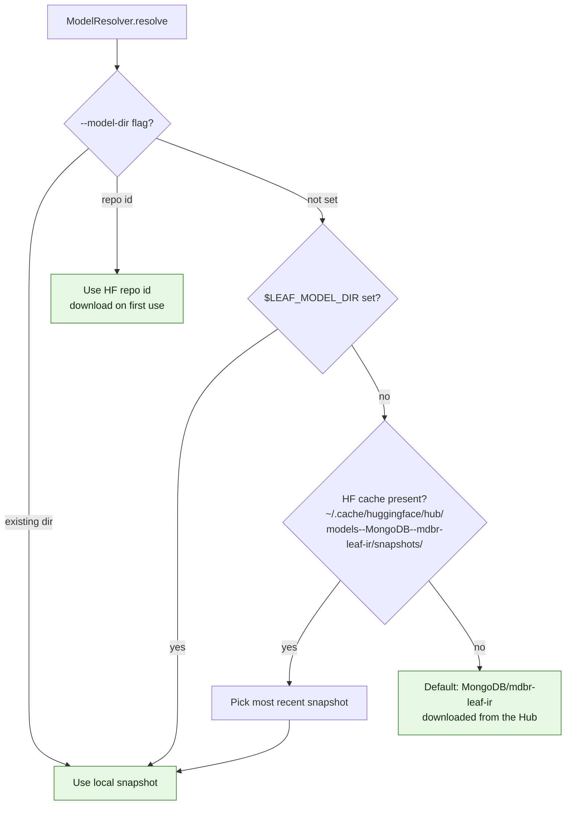
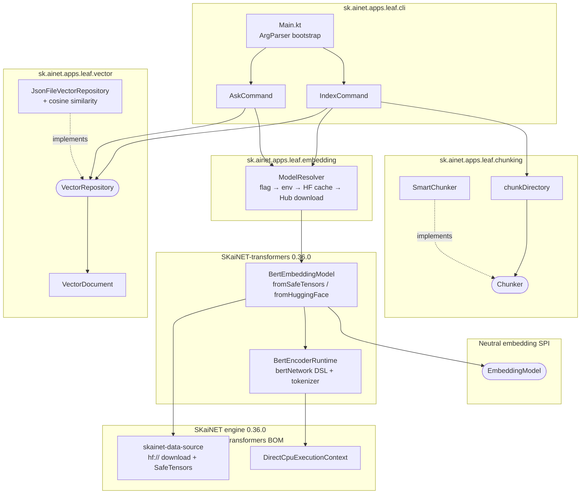

# leaf-cli

A semantic search CLI built on pure JVM. Index your markdown documentation and query it with natural language — no database, no external vector engine, no Python.

Built as a companion project for the JavaLand Unconference session: **"Build Your Own Semantic Search Engine in Pure JVM (No Python, No DB, No Magic)"**.

## How it works



1. **Index** — reads `.md` files, splits them into overlapping chunks via `SmartChunker`, generates embeddings through the neutral `EmbeddingModel` SPI backed by the [MongoDB/mdbr-leaf-mt](https://huggingface.co/MongoDB/mdbr-leaf-mt) model, and persists the result through `JsonFileVectorRepository`.
2. **Ask** — loads the index, reads the model spec recorded inside it, embeds your question, runs cosine similarity over every stored chunk, and returns the top-K matches.

## Prerequisites

- Java 21+

No model setup needed — on first use the model downloads from the Hugging Face Hub (via SKaiNET's `hf://` data source, cached under `~/.cache/skainet/models/`, offline-safe afterwards).

### Model resolution

The CLI never asks where the model lives. `ModelResolver.resolve(...)` walks a fixed priority list and returns a *model spec* — a local snapshot directory **or** a Hugging Face repo id:



For `ask`, resolution is bypassed entirely — the model spec (path or repo id) is written into the index file at `index` time and re-opened on load, so queries always run against the exact model that produced the embeddings.

## Build

```bash
./gradlew shadowJar
```

Produces `build/libs/leaf-cli-all.jar`.

## Usage

### Index a folder of markdown files

```bash
java --enable-preview --add-modules jdk.incubator.vector \
  -jar build/libs/leaf-cli-all.jar index ./docs
```

Options:

| Flag | Default | Description |
|------|---------|-------------|
| `-m`, `--model-dir` | auto-detected | Model directory or HF repo id (downloaded on first use) |
| `-o`, `--output` | `leaf-index.json` | Output index file path |
| `--chunk-size` | `600` | Target chunk size in characters |

### Ask a question

```bash
java --enable-preview --add-modules jdk.incubator.vector \
  -jar build/libs/leaf-cli-all.jar ask "How do I reset a password?"
```

Options:

| Flag | Default | Description |
|------|---------|-------------|
| `-i`, `--index` | `leaf-index.json` | Path to index file |
| `-k`, `--top-k` | `3` | Number of results to return |

### Example output

```
Loading index... done (142 documents)
Loading model... done (1.2s)
Searching... done (45ms)

Question: "How do I reset a password?"
Top 3 results:
────────────────────────────────────────────────────────────

  #1  Score: 0.8234  Source: docs/auth/password-reset.md
  ──────────────────────────────────────────────────────────
  To reset a password, navigate to the settings page and click...

  #2  Score: 0.7891  Source: docs/onboarding/accounts.md
  ──────────────────────────────────────────────────────────
  New users receive a temporary password that must be changed...

  #3  Score: 0.6543  Source: docs/security/credentials.md
  ──────────────────────────────────────────────────────────
  Credential rotation policies require password changes every...
```

## Architecture

The code is split into four small packages — `cli`, `chunking`, `embedding`, `vector` — so each package owns one concern and depends only on stable abstractions (`Chunker`, `EmbeddingModel`, `VectorRepository`).



### Package layout

```
src/main/kotlin/sk/ainet/apps/leaf/
├── cli/
│   ├── Main.kt              # ArgParser bootstrap, wires subcommands
│   ├── IndexCommand.kt      # `index <folder>` — chunk → embed → persist
│   └── AskCommand.kt        # `ask <question>` — load → embed → search → render
├── chunking/
│   ├── Chunker.kt           # `Chunker` SPI + `DocumentChunk` + `chunkDirectory`
│   └── SmartChunker.kt      # paragraph / sentence / line-aware impl with overlap
├── embedding/
│   └── ModelResolver.kt     # model spec resolution: explicit dir|repo id → $LEAF_MODEL_DIR → HF cache → Hub download
└── vector/
    ├── VectorDocument.kt    # serializable id + content + source + chunkIndex + embedding
    ├── VectorRepository.kt  # narrow `add` / `count` / `search` SPI + `ScoredDocument`
    └── JsonFileVectorRepository.kt # in-memory list + JSON persistence + cosine similarity
```

Tests live under `src/test/kotlin/.../{chunking,vector}` and cover the chunker, the directory walker, and the JSON repository round-trip.

## Tech stack

| Component | Technology |
|-----------|------------|
| Language | Kotlin 2.3.0 |
| JVM | Java 21 (with Vector API incubator) |
| Build | Gradle 8.13 (Kotlin DSL) |
| Embedding API | SKaiNET-transformers neutral `EmbeddingModel` SPI (0.36.0) |
| Model inference | SKaiNET DSL-defined BERT encoder on CPU (engine 0.36.0, aligned via transformers BOM) |
| Model format | SafeTensors (HuggingFace sentence-transformers layout, optional `2_Dense/` projection) |
| Embedding model | MongoDB/mdbr-leaf-mt (multilingual; dim = `projectionDim ?? hiddenSize`, 768 for LEAF) |
| CLI parsing | kotlinx-cli |
| Serialization | kotlinx-serialization (JSON) |
| Tests | JUnit 5 + kotlin-test-junit5 |
| Packaging | ShadowJar (fat JAR) |

## Key design decisions

- **Package-per-concern** — `cli`, `chunking`, `embedding`, and `vector` are independent. The CLI is wiring; everything else is plain logic behind an interface (`Chunker`, `EmbeddingModel`, `VectorRepository`). Swapping the chunker, the embedder, or the storage backend is a one-line change in `IndexCommand` / `AskCommand`.
- **Neutral embedding API** — the upstream `BertEmbeddingModel.fromSafeTensors(dir)` / `fromHuggingFace(repoId)` factories return an `EmbeddingModel`, a small provider-neutral SPI shaped like the `embed(text)` / `embed(listOf(...))` / `call(EmbeddingRequest)` contract found across mainstream Java AI frameworks (Spring AI in particular). The CLI never touches BERT-specific types directly.
- **Zero-config model loading by default** — `ModelResolver` checks an explicit flag (directory or repo id), then `LEAF_MODEL_DIR`, then the HuggingFace snapshot cache, and finally downloads `MongoDB/mdbr-leaf-ir` from the Hub. Inside a snapshot, the upstream factory auto-detects the weights file, the optional `2_Dense/` projection head, the `config.json`, and the tokenizer.
- **Persisted model pointer** — `JsonFileVectorRepository.save(modelDir = ...)` writes the model spec (path or repo id) into the index JSON. `ask` reads it back and reopens it via `ModelResolver.open`, guaranteeing the query model matches the indexed embeddings without the user passing `--model-dir` twice.
- **No database** — embeddings live in memory and persist as plain JSON. Vector databases are an optimization layer; this project teaches the fundamentals.
- **No external services** — model inference runs locally on CPU via SKaiNET's BERT runtime.
- **Smart chunking** — the chunker respects paragraph, sentence, and line boundaries rather than cutting mid-word. Chunks overlap by 100 characters for context continuity.
- **Brute-force search** — cosine similarity is computed against every stored embedding. Simple, correct, and sufficient for documentation-scale corpora.
- **Multilingual** — the LEAF model supports 50+ languages out of the box. Index English docs, query in German — it works.

## Version pinning

The app pins **`sk.ainet.transformers:*:0.36.0`** via `platform("sk.ainet.transformers:skainet-transformers-bom:0.36.0")` from public Maven Central. The transformers BOM transitively imports the engine BOM, so every `sk.ainet.core:*` artifact aligns to `0.36.0` automatically (the version lines are kept in lock-step upstream). The version knob lives in one place: `gradle/libs.versions.toml` (`skainetTransformers = "0.36.0"`).

Since 0.36.0 the one-call `BertEmbeddingModel` factory hides the whole runtime / weight-loader / tokenizer assembly, so no engine types leak into this codebase anymore — the only `sk.ainet.core:*` dependency left is the runtime-discovered CPU backend (`skainet-backend-cpu`). The former `LeafEmbeddingModel.kt` (~140 lines of multi-loader merge, config auto-detect, vocab parsing) is deleted; see the upstream [Getting Started with LEAF](https://github.com/SKaiNET-developers/SKaiNET-transformers/blob/develop/docs/modules/ROOT/pages/tutorials/getting-started-leaf.adoc) tutorial.

## License

MIT
